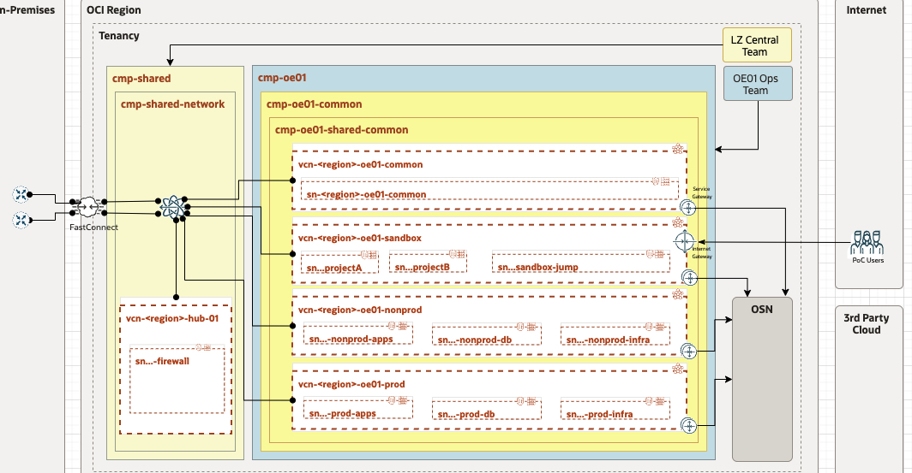

## COTUD CO Shared OCI Intrastructure




```
terraform apply \
-var-file <YOUR_PATH>/oci-credentials.tfvars.json \
-var-file <YOUR_PATH>/oelz_shared_security.auto.tfvars.json \
-var-file <YOUR_PATH>/oelz_shared_network.auto.tfvars.json \
-state <YOUR_PATH>/terraform.tfstate \
/
```


```
terraform apply \
-var-file /Users/COTUDOR/Work/VSCODE-Workspace/FY22/landing_zone_framework/patterns/OELZ/examples/lz_central_operations_repo_example/LZ_OPS_CENTRAL_REPO/SHARED-COTUD04/oci-credentials.tfvars.json \
-var-file /Users/COTUDOR/Work/VSCODE-Workspace/FY22/landing_zone_framework/patterns/OELZ/examples/lz_central_operations_repo_example/LZ_OPS_CENTRAL_REPO/SHARED-COTUD04/oelz_shared_security.auto.tfvars.json \
-var-file /Users/COTUDOR/Work/VSCODE-Workspace/FY22/landing_zone_framework/patterns/OELZ/examples/lz_central_operations_repo_example/LZ_OPS_CENTRAL_REPO/SHARED-COTUD04/oelz_shared_network.auto.tfvars.json \
-state /Users/COTUDOR/Work/VSCODE-Workspace/FY22/landing_zone_framework/patterns/OELZ/examples/lz_central_operations_repo_example/LZ_OPS_CENTRAL_REPO/SHARED-COTUD04/terraform.tfstate \
/
```